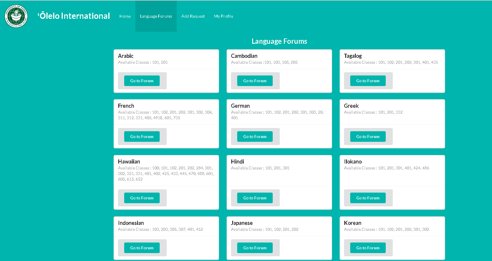

[Olelo International](http://olelointernational.meteorapp.com/#/) is a forum for language learners to discuss. There are two parts of the Olelo International, forums and request forum. Forum is the main part of the web app. The main page of the forum list all the language forums. Each forum shows the posts of the corresponding language. Users can also comment under each posts as well. The second part of the app is request forum. Users also can request for a new language forum. 

The main part I contributed was creating posts. Every post on the forum is showing as a card. A card that has topic, description, and comment section. The challenge I faced during the app development was sorting the posts by latest time. For sorting the posts, I was adding new property createdAt. Use this "sort: { createdAt: -1 }" would sort the post started from the latest to the oldest. 

In this group project I was learning a lot on communicating with my groupmates. Our groupmates communicate on Slack, ask helps and questions of the project. I found out it is important and helpful that having good communication is because other groupmates can know what you are working on, the current status of the work, and they can provide help like finding mistake and give new idea on how to solve the problem you have. Without communication, people in the group can't help you or know what you are trying to do. 

Here is the [link](https://github.com/olelo-international/Final-Project-App) to my organization of the final project on GitHub.
